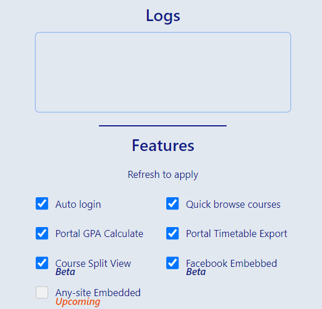
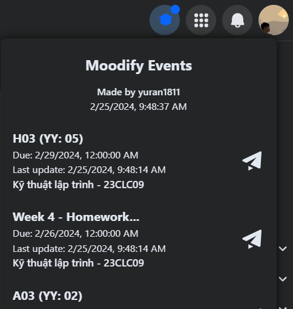

<h1 align="center" style="font-size: 32px">Moodify (Official)</h1>

<strong>Moodle site modifying and lots of awesome features are out of the box!</strong>

  
  
  
  

  

### Release

- [Release](https://github.com/yuran1811/moodify/releases)
- [Change log](/md/CHANGELOG.md)
- [Todo](/md/TODO.md)

### Features

- [x] Light (~213kb), fast and reliable
- [x] Auto signin to Moodle, Portal sites (if use the same account info)
- [x] Course page improvements
  - `Course Plit View` feature
  - `Courses Quick Browse` feature
  - Pages restyling
- [x] Watching moodle events on Facebook

#### Upcoming Features

- Watching moodle events on any provided sites.

### Supported sites

- https://courses.hcmus.edu.vn
- https://portal.hcmus.edu.vn/SinhVien.aspx?pid=211

- https://courses.ctda.hcmus.edu.vn
- https://portal.ctdb.hcmus.edu.vn
- https://portal.ctdb.hcmus.edu.vn/sinh-vien/ket-qua-dkhp

### Screenshot

#### Auto Sign In

##### Popup

| Popup Image 1                                        | Popup Image 2                                        |
| ---------------------------------------------------- | ---------------------------------------------------- |
|  |  |

##### Extension Active Status

#### Moodle Page Modifications

|                    | Before                                               | After                                                        |
| ------------------ | ---------------------------------------------------- | ------------------------------------------------------------ |
| Navigation Bar     |             |             |
| Home Page          |           |           |
| Courses Page       |     |     |
| Course Detail Page |  |  |

#### Facebook Integration

- To load events data from Moodle, ensure that you have logged in at [here](https://courses.ctda.hcmus.edu.vn).

> **Info**: Visit the Moodle site frequently to update new events.

> **Note**: The extension will not work if you are not logged in to the Moodle site. The extension will automatically log in to the Moodle site if you have enabled the `Auto Sign In` feature.If you have not enabled the `Auto Sign In` feature, you need to log in to the Moodle site manually to use this feature.

| Empty                                                     | Not Empty                                               |
| --------------------------------------------------------- | ------------------------------------------------------- |
|  |  |

#### GPA Calculator

##### Step 1: Enable `Portal GPA Calculate` feature in extension popup

##### Step 2: Drag and drop the `GPA Calculator` to the bookmark bar

##### Step 3: Click the `GPA Calculator` bookmarklet

#### Export Timetable

- Do the same step as `GPA Calculator` but with `Export Timetable` feature.

---

### Installation

- Download the latest release [zip](https://github.com/yuran1811/moodify/releases).
- Unzip the file to `/moodify` folder.
- Goto [`chrome://extensions/`](chrome://extensions/).
- Click `Load unpacked` and choose the `/moodify` folder or drag and drop the folder to `chrome://extensions/`.
- Extension is available now!

### References

- Many thanks to this [inspired repo](https://github.com/tinwritescode/hcmus-moodle-improved) and [Noboroto's Fork](https://github.com/Noboroto/hcmus-moodle-improved), I've create this with a bunch of new features and improvements.
